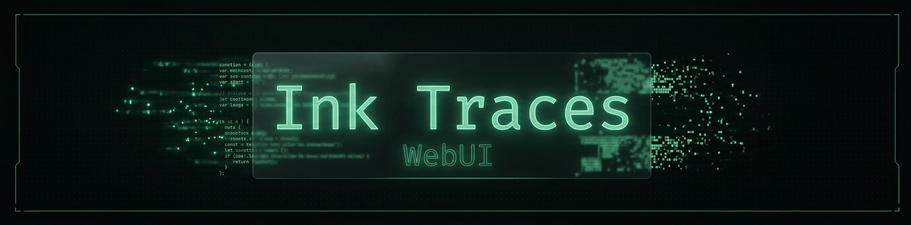
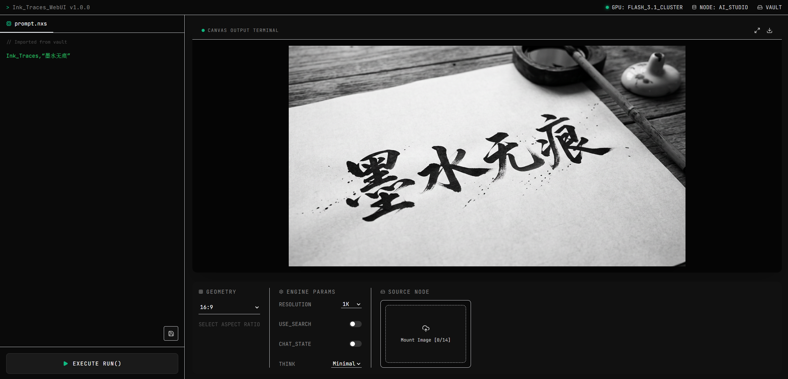

# Ink Traces WebUI

<p align="center">
  
</p>

<p align="center">
  <strong>面向 Gemini、Seedream 和 Seedance 的 AI 图片 / 视频生成工作站。</strong>
</p>

<p align="center">
  <a href="../README.md">English</a> · 中文
</p>

---

## 项目概览

Ink Traces WebUI 是一个本地运行的 AI 图片 / 视频生成工作站。它使用 React/Vite 构建前端，Flask 提供后端 API，支持多 Provider 切换、SQLite 任务队列、Prompt Vault、本地结果恢复，并把真实密钥和本地 Prompt 数据排除在 Git 仓库之外。

<p align="center">
  
</p>

## 功能亮点

| 模块 | 支持能力 |
|---|---|
| 图片生成 | 文生图和图生图共用一个工作流，自动识别是否有参考图 |
| 视频生成 | 支持首尾帧模式，以及图片、视频、音频参考模式 |
| Provider | Google Vertex AI、Google AI Studio、BytePlus Ark Seedream、Ark/Jiekou Seedance |
| Prompt 工作流 | Prompt Vault、全屏编辑器、多标签页、收藏复用 |
| 任务历史 | SQLite 任务队列，支持图片/视频结果记录、恢复和删除 |
| 参数控制 | 宽高比、分辨率、思考深度、Google 搜索增强、Chat 模式 |
| 隐私边界 | 真实 `config.json`、Prompt Vault、日志、输出、上传文件和数据库均不进入 Git |

## 技术栈

| 层级 | 技术 |
|---|---|
| 前端 | React 18、Vite、Tailwind CSS、Framer Motion、Lucide Icons |
| 后端 | Python Flask、Flask-CORS、Pillow、Requests |
| 存储 | SQLite 任务数据库 + 本地输出目录 |
| AI API | Gemini 图片生成、Ark Seedream 图片生成、Seedance 视频生成 |

## 快速开始

### 环境要求

- Python 3.8+
- Node.js 18+
- 至少准备一个 Provider 的 API 凭据

### 安装并启动

```bash
# 从仓库内的模板创建本地配置
cp config.json.example config.json

# 编辑 config.json，填入 Provider 凭据

# 启动前后端服务
./start.sh
```

浏览器访问：

```text
http://localhost:4545
```

停止服务：

```bash
./stop.sh
```

## 配置说明

仓库只提交模板文件，真实运行文件会被 Git 忽略。

| 文件 | 用途 | Git 状态 |
|---|---|---|
| `config.json.example` | 公开配置模板，所有凭据为空 | 已提交 |
| `config.json` | 本地密钥、端口、Provider、认证配置 | 已忽略 |
| `server/prompts.json.example` | Prompt Vault 示例数据 | 已提交 |
| `server/prompts.json` | 应用运行时生成的本地 Prompt Vault 数据 | 已忽略 |

最小图片 Provider 配置示例：

```json
{
  "api": {
    "default_provider": "ai_studio",
    "ai_studio": {
      "key": "<your-ai-studio-key>",
      "model_id": "gemini-3.1-flash-image-preview",
      "endpoint": "generativelanguage.googleapis.com"
    }
  }
}
```

如果使用 Ark 视频参考素材上传，需要配置 `server.public_host`、`server.public_port` 和 `server.public_scheme`，确保外部服务能够下载参考视频文件。

## 项目结构

```text
Ink_Traces_WebUI/
├── README.md                    # 英文 GitHub 首页 README
├── config.json.example          # 公开配置模板
├── start.sh / stop.sh           # 服务启停脚本
├── clean.sh                     # 本地清理脚本
├── client/                      # React 前端
│   └── src/
│       ├── App.jsx              # 主界面、多标签、图片/视频工作流
│       └── components/          # 上传、结果展示、Vault、任务队列组件
├── server/
│   ├── app.py                   # Flask API、Provider 调用、视频轮询
│   ├── tasks.py                 # SQLite 任务队列工具
│   ├── prompts.json.example     # 公开 Prompt Vault 示例
│   └── requirements.txt
├── doc/
│   ├── README.md                # 中文 README
│   ├── Agents.md                # 开发说明
│   ├── image_doc.md             # 图片 API 说明
│   ├── video_doc.md             # 视频 API 说明
│   └── price.md                 # 价格说明
└── output/                      # 本地生成结果，已忽略
```

## API 概览

| 接口 | 用途 |
|---|---|
| `GET /api/health` | 后端健康检查 |
| `GET/POST /api/provider` | 获取或切换图片 Provider |
| `GET/POST /api/model` | 获取或切换图片模型 |
| `POST /api/generate` | 统一图片生成接口 |
| `GET/POST /api/prompts` | 读取或保存 Prompt Vault |
| `PUT/DELETE /api/prompts/:id` | 编辑或删除 Prompt Vault 条目 |
| `GET/POST /api/video/provider` | 获取或切换视频 Provider |
| `POST /api/video/generate` | 提交视频生成任务 |
| `GET /api/video/task` | 查询外部视频任务状态 |
| `GET /api/tasks` | 查看本地任务历史 |
| `GET/DELETE /api/tasks/:id` | 恢复或删除本地任务 |
| `POST /api/upload_video` | 上传供外部 Provider 下载的参考视频 |

## 运行时数据

以下路径会被 Git 忽略：

- `config.json`
- `server/prompts.json`
- `tasks.db`、`tasks.db-shm`、`tasks.db-wal`
- `output/`
- `upload_video/`
- `error_logs/`
- `*.log`
- `node_modules/`
- `client/dist/`

这可以避免 API 密钥、Prompt 收藏、生成结果、日志、上传素材和本地任务历史进入仓库。

## 注意事项

- Chat 会话存储在后端内存中，Flask 进程重启后会丢失。
- 视频生成是异步流程，后端会用后台线程轮询 Provider 任务状态。
- Ark 参考视频工作流要求 Provider 能访问你的公网下载 URL。
- Flask 后端适合本地或受控部署，不建议直接用于高并发生产环境。
- `config.json` 可以调整安全过滤级别，但 Provider 侧仍可能有不可关闭的底线过滤。

## License

MIT
